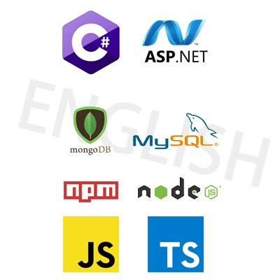

# 最後記錄

原定計畫為0204才停止庫的紀錄，但過年期間忙碌因此提早3天結束，後續會先以0129的技術文章瀏覽結束後再繼續技術學習。

## 以2022年結束前訂下目標:
1. 熟練使用C#
2. JavaScript更進一步熟悉
3. 將一部分JS檔案以typeScript製作編譯產出實際應用在專案上
4. ASP.NET熟悉製作
5. MySql+MongoDB 熟悉兩套資料庫
6. nvm npm使用至熟悉程度
7. nodeJS基本了解
8. 英文加強至可以不靠翻譯軟體閱讀技術文件 日常溝通則不需要

9. 保護肝+腎 不要掛了
10. 你野心會不會太大?

## 技術圖

## 心得

轉職以2021-04-20進入巨匠參加職訓課課程(創意網站實務班)，過程中以教導HTML、CSS、Bootstrap、jQuery為主，因疫情延後至7/22結訓，結訓後以自學方式透過MDN、W3C、TI邦等等前人分享知識及各項技術文件在2022/01/28獲取台北市前端開發工程師offer。

本儲存庫記錄自結訓後零散的接觸前端相關知識，0905開始執行每日自學計畫並記錄至獲得offer，若有因此儲存庫而獲得有效幫助望繼續以此心態幫助更多人加入網頁前後端開發領域。

## 以下為本人自學中結合技術及即時靈感架設的網站

#### myTest紀錄測試庫
> [點我前往](https://ayvc0420.github.io/myTest/%E7%B7%B4%E7%BF%92/%E6%AF%8F%E6%97%A5%E7%B7%B4%E7%BF%92/daily.html)

#### 帶你快速了解hololive|現今最紅的VTuber
> [點我前往](https://ayvc0420.github.io/)

#### 前端技術分享介紹
> [點我前往](https://ayvc0420.github.io/webDesign/index.html)

#### 猜數字遊戲
> [點我前往](https://ayvc0420.github.io/guessNumber/)

#### 點擊標靶遊戲
> [點我前往](https://ayvc0420.github.io/targetGame/)

## 技術參考網頁:

#### 前端JS各項技術 Vue技術 - Alex宅幹嘛頻道
> [點我前往](https://www.youtube.com/channel/UCEL8871qFEakpqYpwBSjHNA)

#### 前端HTML、CSS技術 - CSScoke頻道
> [點我前往](https://www.youtube.com/c/CSScoke)

#### 六角學院相關前端技術分享頻道
> [點我前往](https://www.youtube.com/channel/UC-b2nGm0xLzic38Byti0VjA)

#### 前端HTML、CSS、JS技術 - 彭彭的課程頻道
> [點我前往](https://www.youtube.com/channel/UCguZS-y7codLSt6vpkVdnKg)

#### 卡斯伯Blog
> [點我前往](https://wcc723.github.io/)

#### MDN文件
> [點我前往](https://developer.mozilla.org/zh-TW/)

#### GitHub各種JS庫
> [點我前往](https://github.com/)

#### W3C文件
> [點我前往](https://www.w3schools.com/)

#### Ti邦
> [點我前往](https://ithelp.ithome.com.tw/questions)

#### 切版練習網頁
> [點我前往](https://www.templatemonster.com/)

#### Vue.JS詳細文件網站 - 作者:Kuro
> [點我前往](https://book.vue.tw/)

#### Vue document
> [點我前往](https://vuejs.org/)

#### 最終且最實用的Google
[點我前往](https://www.google.com)/